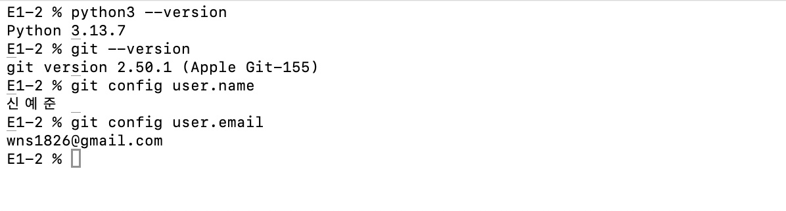
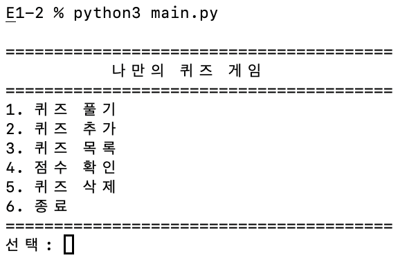
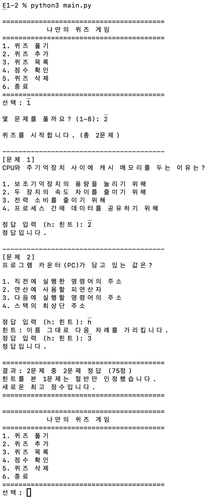
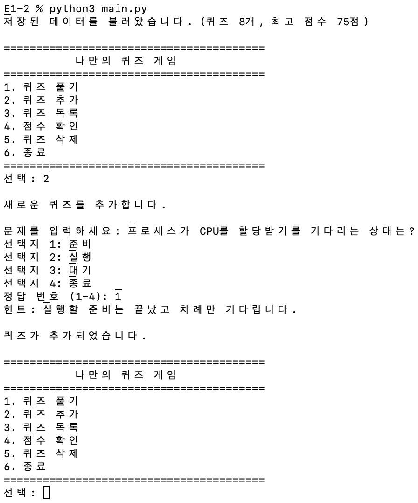
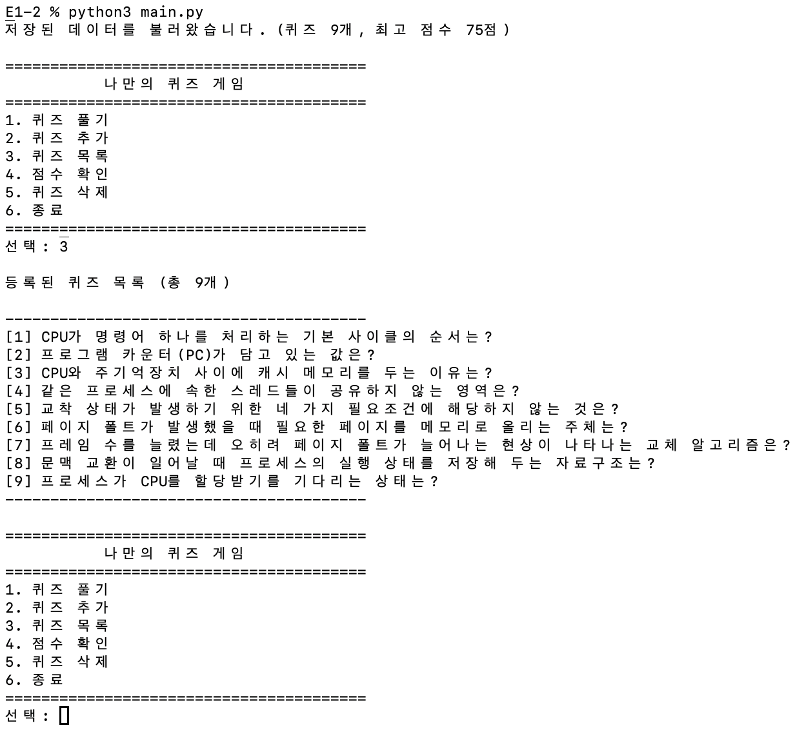
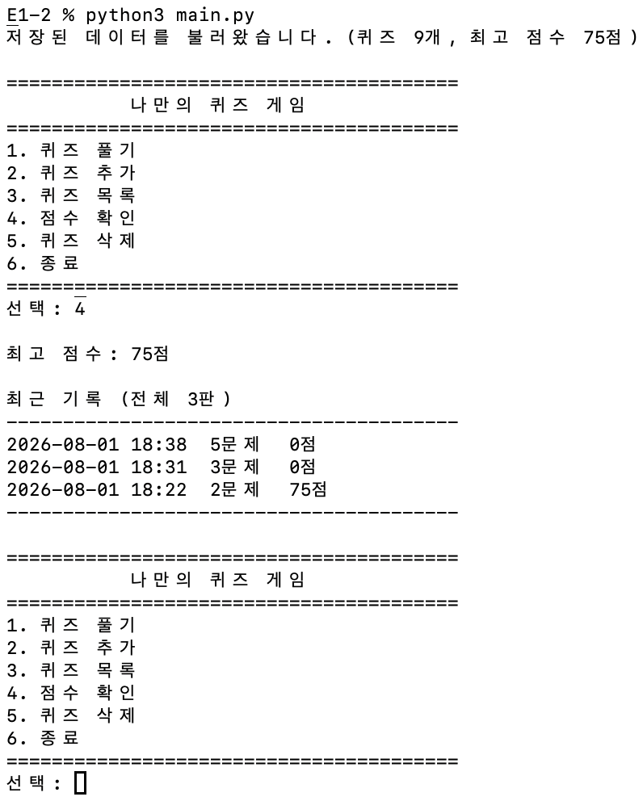
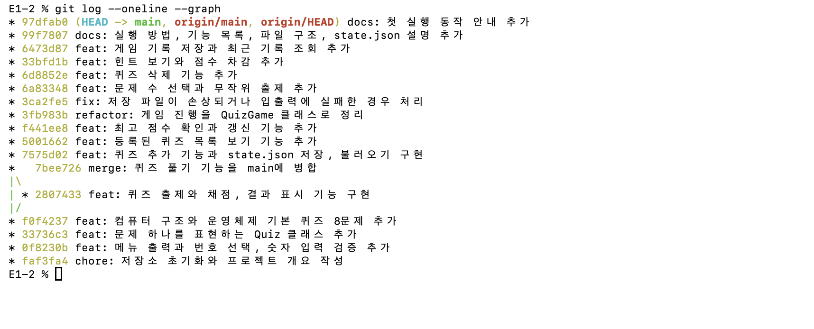

# E1-2 컴퓨터에게 명령 내리는 말(파이썬) 처음 배우기

## 프로젝트 개요

터미널에서 동작하는 사지선다 퀴즈 게임입니다. 메뉴에서 번호를 선택해 퀴즈를 풀고, 새 퀴즈를 등록하고, 등록된 목록과 점수 기록을 확인할 수 있습니다. 추가한 퀴즈와 점수 기록은 `state.json` 에 저장되므로 프로그램을 종료하고 다시 실행해도 그대로 남습니다.

Python 3.10 이상에서 표준 라이브러리만 사용해 동작합니다.

## 퀴즈 주제와 선정 이유

퀴즈 주제는 컴퓨터 구조와 운영체제입니다.

다음 미션에서 CPU와 NPU 얘기가 나와서 이 범위로 정했습니다.

기본 문제는 8개이며, 명령어 사이클과 프로그램 카운터, 캐시 메모리, 스레드의 공유 영역, 교착 상태의 필요조건, 페이지 폴트와 페이지 교체 알고리즘, 문맥 교환을 다룹니다.

## 개발 환경

macOS에서 Python 3.13.7로 작업했습니다.



## 실행 방법

```bash
git clone https://github.com/yessjun/E1-2.git
cd E1-2
python3 main.py
```

첫 실행에서는 `state.json` 이 없으므로 코드에 들어 있는 기본 퀴즈 8개로 시작합니다. 이후에는 저장된 파일을 읽어 시작합니다.

## 기능 목록

메뉴에서 번호를 골라 사용합니다.

| 번호 | 기능 | 설명 |
|---|---|---|
| 1 | 퀴즈 풀기 | 풀 문제 수를 고르면 그만큼 무작위로 출제하고, 문제마다 정답 여부를 알려준 뒤 결과와 점수를 표시합니다. 정답 대신 `h` 를 누르면 힌트를 봅니다 |
| 2 | 퀴즈 추가 | 문제, 선택지 4개, 정답 번호, 힌트를 입력받아 등록합니다 |
| 3 | 퀴즈 목록 | 등록된 퀴즈를 번호와 함께 보여줍니다 |
| 4 | 점수 확인 | 최고 점수와 최근 다섯 판의 기록을 보여줍니다 |
| 5 | 퀴즈 삭제 | 번호로 퀴즈 하나를 골라 삭제합니다 |
| 6 | 종료 | 프로그램을 끝냅니다 |

점수는 맞힌 문제 수를 백분율로 환산한 값이고, 힌트를 본 문제는 맞혀도 절반만 인정합니다. 이전 최고 점수보다 높으면 갱신하고, 한 판이 끝날 때마다 날짜와 시간, 푼 문제 수, 점수를 기록에 남깁니다.

숫자를 입력받는 곳에서는 앞뒤 공백을 지운 뒤 처리하고, 숫자가 아니거나 허용 범위를 벗어나거나 아무것도 입력하지 않으면 안내 메시지를 출력한 뒤 다시 입력받습니다.

```
선택: abc
잘못된 입력입니다. 1-6 사이의 숫자를 입력하세요.
선택: 9
잘못된 입력입니다. 1-6 사이의 숫자를 입력하세요.
선택:
입력이 비어 있습니다. 1-6 사이의 숫자를 입력하세요.
```

퀴즈를 푸는 도중 `Ctrl+C` 를 누르거나 입력이 끊기면 안내 메시지를 출력하고 그때까지의 상태를 저장한 뒤 종료합니다. 등록된 퀴즈가 하나도 없으면 퀴즈 풀기와 목록, 삭제는 각각 안내 메시지만 출력하고 메뉴로 돌아옵니다.

## 실행 화면

프로그램을 실행하면 메뉴가 나옵니다.



1번을 고르면 풀 문제 수를 묻고, 그만큼 무작위로 출제합니다. 정답 대신 `h` 를 누르면 힌트가 나오고, 마지막에 맞힌 개수와 점수를 보여줍니다.



2번은 문제와 선택지 4개, 정답 번호를 차례로 입력받습니다.



3번으로 목록을 보면 방금 추가한 퀴즈가 9번으로 들어가 있습니다.



4번은 최고 점수와 최근 기록을 보여줍니다. 프로그램을 다시 실행했는데도 퀴즈 9개와 점수 기록이 그대로인 것은 `state.json` 에서 읽어왔기 때문입니다.



## 파일 구조

```
E1-2/
├─ main.py             # 프로그램 전체
├─ README.md
├─ .gitignore
├─ docs/screenshots/   # 실행 화면
└─ state.json          # 실행하면 생성되는 데이터 파일 (저장소에는 포함하지 않음)
```

`main.py` 한 파일에 클래스 두 개가 들어 있습니다.

- `Quiz` 는 문제 하나를 담습니다. 속성은 `question`, `choices`, `answer`, `hint` 이고, 문제를 출력하는 `show()`, 입력한 번호가 정답인지 판단하는 `is_correct()`, JSON으로 바꾸고 되돌리는 `to_dict()` 와 `from_dict()` 가 있습니다.
- `QuizGame` 은 퀴즈 목록과 최고 점수, 게임 기록을 들고 메뉴를 진행합니다. `run()` 이 메뉴 반복을 담당하고 `play()`, `add_quiz()`, `list_quizzes()`, `show_score()`, `delete_quiz()`, `load()`, `save()` 로 기능이 나뉘어 있습니다.

입력을 받는 `read_int()` 와 `read_text()` 는 게임 상태와 관계없이 어디서든 쓰이므로 클래스 밖에 두었습니다. 기본 퀴즈 8개는 `default_quizzes()` 가 `Quiz` 인스턴스 목록으로 만들어 돌려줍니다.

## 데이터 파일 설명

`state.json` 은 `main.py` 와 같은 디렉터리, 즉 프로젝트 루트에 만들어집니다. 실행 위치와 무관하게 같은 파일을 쓰도록 `main.py` 의 절대 경로를 기준으로 잡았습니다.

```python
STATE_FILE = os.path.join(os.path.dirname(os.path.abspath(__file__)), "state.json")
```

인코딩은 UTF-8이고, 한글이 이스케이프되지 않도록 `ensure_ascii=False` 로 저장합니다. 퀴즈를 추가하거나 삭제했을 때, 그리고 퀴즈 풀기를 마쳤을 때 저장합니다.

| 필드 | 타입 | 역할 |
|---|---|---|
| `quizzes` | 배열 | 등록된 퀴즈 전체 |
| `quizzes[].question` | 문자열 | 문제 |
| `quizzes[].choices` | 문자열 배열 4개 | 선택지 |
| `quizzes[].answer` | 정수 1-4 | 정답 선택지 번호 |
| `quizzes[].hint` | 문자열 | 풀이 중에 볼 수 있는 힌트 |
| `best_score` | 정수 또는 `null` | 최고 점수. 한 번도 풀지 않았으면 `null` |
| `history` | 배열 | 한 판이 끝날 때마다 쌓이는 기록 |
| `history[].played_at` | 문자열 | 끝낸 날짜와 시간 |
| `history[].total` | 정수 | 그 판에서 푼 문제 수 |
| `history[].score` | 정수 | 그 판의 점수 |

```json
{
  "quizzes": [
    {
      "question": "CPU가 명령어 하나를 처리하는 기본 사이클의 순서는?",
      "choices": [
        "해석 - 인출 - 실행",
        "인출 - 해석 - 실행",
        "실행 - 인출 - 해석",
        "인출 - 실행 - 해석"
      ],
      "answer": 2,
      "hint": "명령어를 먼저 가져와야 무엇을 할지 정할 수 있습니다."
    }
  ],
  "best_score": 88,
  "history": [
    {
      "played_at": "2026-08-01 18:05",
      "total": 8,
      "score": 88
    }
  ]
}
```

파일이 없으면 기본 퀴즈로 시작하고, 파일이 깨졌거나 필요한 키가 없으면 안내 메시지를 출력한 뒤 역시 기본 퀴즈로 초기화합니다.

```
$ python3 main.py
state.json 을 읽을 수 없어 기본 퀴즈로 시작합니다.
```

실행할 때마다 값이 바뀌는 파일이라 `.gitignore` 에 넣어 저장소에는 올리지 않습니다.

## 커밋 기록

기능 하나를 끝낼 때마다 커밋했고, 퀴즈 풀기는 `feature/quiz-play` 브랜치에서 만든 뒤 `main` 에 병합했습니다.


